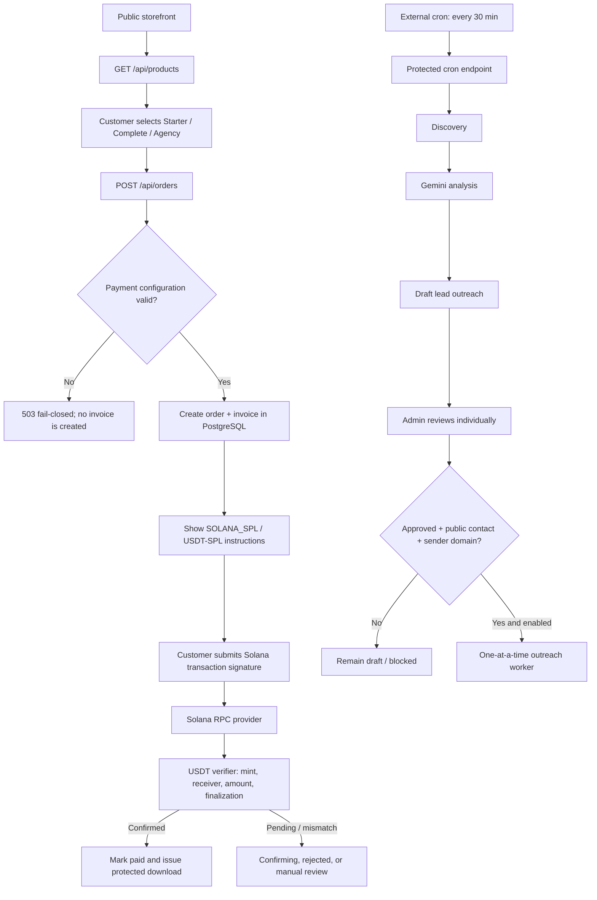

# System Summary Cycle

## ملخص تنفيذي

هذه الوثيقة هي المراجعة الجذرية لدورات منصة **Client Payment & Scope Protection Kit** كما تعمل فعليًا في مستودع `mkkh01/Test` وعلى خدمة Render العامة. تاريخ المراجعة هو **24 أغسطس 2026**. الهدف من المراجعة هو فصل ما تم إثباته فعليًا عن ما هو موجود في الكود فقط، واكتشاف نقاط الفشل التي قد تضر بالعميل أو بالمالك.

الحالة الحالية مستقرة من ناحية التشغيل الأساسي. آخر فحص حي أعاد `ok=true`، و`postgresConfigured=true`، و`solanaRpcConfigured=true`، و`usdtConfigured=true`، و`paymentConfigurationValid=true`. كما نجحت مجموعة الاختبارات البرمجية كاملة: **27 اختبارًا من 27**. تم إنشاء فاتورة اختبار واحدة دون دفعها للتأكد من أن الرد الفعلي أصبح `SOLANA_SPL` و`USDT-SPL` وبقيمة Complete مقدارها 7 USDT. لم تُنفذ أي عملية تحويل USDT حقيقية، ولم يُرسل بريد جديد، ولم تُشغّل دورة Cron حية أثناء هذه المراجعة.

المشكلة التي كشفتها الصورة كانت حقيقية وليست مجرد عرض قديم في لوحة الإدارة. كانت الفاتورة الجديدة نفسها تعرض `TRC20` وعنوانًا يبدأ بـ`T`. السبب كان بقاء إعدادات بيئة قديمة في Render مع وجود نص واجهة حديث يعرض Solana. تم نشر إصلاحين: `55ddbba` لمنع الفاتورة الخاطئة، ثم `e445e60` لاستخدام إعدادات Solana المعروفة بأمان عند وجود قيم قديمة أو غير صالحة. الطلبات القديمة لم تُحذف، بما في ذلك الطلبات التجريبية السابقة.

## دورة النظام الكاملة

الدورة الأساسية مقسمة إلى أربع حلقات مستقلة. حلقة المتجر تنشئ الطلب والفاتورة. حلقة الدفع تتحقق من التوقيع على شبكة Solana. حلقة التسليم تفتح رابط تنزيل محميًا بعد التأكيد. أما حلقة اكتشاف العملاء فتنتج مسودات فقط، ولا تتحول إلى إرسال إلا بعد موافقة بشرية منفردة وشروط أمان إضافية.

## الدورة الأولى: المتجر والأسعار

يبدأ العميل من الصفحة العامة، ثم يجلب المتجر المنتجات من `GET /api/products`. الأسعار الفعلية التي يعيدها النظام الآن هي **Starter = 5 USDT، Complete = 7 USDT، Agency = 10 USDT**. السعر النهائي لا يعتمد على الرقم الموجود في المتصفح فقط؛ عند إنشاء الطلب يقرأ الخادم المنتج النشط من قاعدة البيانات ثم يحفظ المبلغ داخل الطلب والفاتورة.

| المنتج | السعر الفعلي الحي | حالة الفحص |
|---|---:|---|
| Starter | 5 USDT | ظهر في `/api/products` |
| Complete | 7 USDT | استُخدم في فاتورة الاختبار |
| Agency | 10 USDT | ظهر في `/api/products` |

يوجد انحراف تاريخي يجب إصلاحه لاحقًا بهجرة قاعدة بيانات واضحة: ملف `supabase/migrations/001_initial_schema.sql` يحتوي seed قديمًا بقيم **3/7/12**، بينما قاعدة البيانات الحية والواجهة الآن تستخدم **5/7/10**. هذا لا يغيّر الأسعار الحالية، لكنه خطر عند إعادة إنشاء قاعدة البيانات أو تطبيق الهجرة الأولى على بيئة جديدة. لم تُطبّق هجرة تصحيحية `006` أثناء هذه المراجعة لأنها عملية بيانات تشغيلية تحتاج قرارًا مستقلًا.

## الدورة الثانية: الدفع والفاتورة

مسار إنشاء الطلب هو `POST /api/orders` في `server.js`. قبل أي insert، يمر المسار عبر `paymentConfig()`. الشبكة التي يخرج بها الطلب هي `SOLANA_SPL` فقط، والعقد هو USDT-SPL mint الرسمي، والعنوان يجب أن يكون عنوان Solana صالحًا بطول 32 بايت بعد فك Base58. إذا كانت البيئة تحتوي قيمة TRON أو قيمة ناقصة، يتجاهلها المسار الآمن ويستخدم الإعداد canonical المعروف للمشروع، ولا يسمح بإنتاج فاتورة TRC20.

تُحفظ الشبكة والعنوان والمبلغ في كل من `orders` و`invoices` وقت الإنشاء. هذا مهم لأن تغيير إعدادات المستقبل لا يجب أن يعيد كتابة تاريخ الفواتير القديمة. لذلك تبقى طلبات TRC20 القديمة موجودة، لكنها تاريخية ولا يجوز استخدامها للدفع. لوحة الإدارة تميزها بصريًا وتخفي عنها إجراءات إعادة الفحص أو الموافقة اليدوية.

عند إرسال توقيع Solana، يستخدم النظام `src/integrations/solana-rpc-provider.js` و`src/integrations/usdt-verifier.js`. التحقق لا يعتمد على وجود التوقيع فقط، بل يطابق الشبكة، وعنوان الاستلام، وUSDT-SPL mint، والمبلغ الكافي، وحالة النجاح، وحالة `finalized`، وعدد التأكيدات المطلوب. معاملات الشبكة الخطأ أو العقد الخطأ أو المبلغ الناقص تُرفض.

> **قاعدة تشغيل مهمة:** لا تستخدم أي فاتورة تعرض `TRC20` أو عنوانًا يبدأ بـ`T`. يجب إنشاء فاتورة جديدة والتأكد من ظهور `SOLANA_SPL` و`USDT-SPL` قبل إرسال أي مبلغ.

## الدورة الثالثة: التسليم والملفات

بعد نجاح التحقق، ينتقل الطلب إلى حالة الدفع المؤكد ويُنشأ أو يُستخدم رابط تنزيل محمي بالـ token. ملفات ZIP لا تُعرض من المعاينة العامة ولا تُتاح قبل الدفع. النظام يفرّق بين صفحة `/preview` التسويقية، التي تعرض مكونات مرئية مختارة، وبين ملف التسليم الكامل المحمي.

تم اختبار طبقة التحقق والتسليم في اختبارات محاكاة، بما فيها الدفع الصحيح، الدفع غير النهائي، المبلغ الناقص، المحفظة الخطأ، والعقد الخطأ. لكن لم يُنفذ اختبار Mainnet حقيقي بمبلغ حقيقي، ولذلك لا يصح وصف النظام بأنه اجتاز اختبار شراء حي كاملًا.

## الدورة الرابعة: نموذج العميل والبريد

نموذج `POST /api/intake` يستقبل بيانات العميل وسبب المشكلة والنتيجة المطلوبة وطريقة التواصل. إرسال عينة البريد مشروط بطلب صريح من العميل وباختيار البريد كطريقة تواصل. مزود Resend يطبق وضع الاختبار، ويفرض أن يكون المستلم هو `EMAIL_TEST_TO` المصرح به أثناء الاختبار. القالب يحتوي plain text وHTML و`Reply-To` و`Idempotency-Key`.

هذا المسار مناسب للرسائل التي طلبها العميل صراحة، وليس للتواصل البارد. لا يوجد ادعاء بأن أي مزود يضمن الوصول إلى Inbox. الإرسال الحقيقي للعملاء يحتاج نطاقًا مملوكًا وموثقًا مع SPF وDKIM وDMARC. الوضع الحالي يستخدم sender اختباريًا، ولذلك إرسال outreach الحقيقي محظور عمدًا.

## الدورة الخامسة: اكتشاف العملاء والمسودات

يستخدم `discovery-worker.js` مصادر عامة فقط: Hacker News وBluesky وDEV Community وStack Exchange API العام. العناصر تُحفظ في `source_items` مع deduplication، ثم تُنشأ وظائف تحليل في `jobs`. يقوم `lead-analysis-worker.js` بإرسال النص العام إلى Gemini ويخزن النتيجة في `leads` و`lead_analyses` و`outreach_messages`.

النتيجة الطبيعية لهذه الدورة هي **مسودة** لا رسالة مرسلة. كل مسودة يجب أن تحمل `approval_required=true` و`needs_human_review=true`. لوحة `/admin.html` تعرض المصدر والدليل والنتيجة والمسودة والبريد العام وحالة الرسالة وحالة البيع. الموافقة الفردية تحتاج بريدًا عامًا وموافقة صريحة، وتنتج رسالة queued مع سجل تدقيق.

تمت معالجة ملاحظة جودة جامع DEV: العبارات متعددة الكلمات تُحوّل الآن إلى tags مثل `late-invoice` مع استمرار الفلترة النصية النهائية.

## الدورة السادسة: Cron والعمال

المسار المحمي هو `POST /api/internal/cron/run` مع Bearer secret. يقوم بتشغيل دورة واحدة بالتسلسل: discovery ثم Gemini lead analysis ثم payment worker ثم outreach worker. توجد حماية من التشغيل المتزامن، وتعيد الخدمة `409` إذا كانت دورة سابقة تعمل.

البديل الحالي هو GitHub Actions كل 30 دقيقة، لأن المستخدم اختار إبقاء Render Web Service على الخطة المجانية. workflow في `.github/workflows/lead-discovery-cycle.yml` يستدعي endpoint المحمي باستخدام `GITHUB_TOKEN` ويتحقق الخادم من مستودع `mkkh01/Test`. وجود `cronTriggerConfigured=true` يظل دعمًا لتفويض Bearer القديم، وليس دليلًا على ضرورة cron-job.org.

| الخيار | حالته | الملاحظة |
|---|---|---|
| GitHub Actions كل 30 دقيقة | الخيار الحالي | workflow مرفوع، وشُغّل اختبار يدوي ناجح؛ تُراجع دورية التشغيل من Actions |
| Render Cron / Background Worker | غير منشأ | يحتاج خدمة مدفوعة أو إعدادًا مختلفًا؛ لم يتم إنشاؤه |

عامل outreach لا يعمل إلا عندما تكون `OUTREACH_SEND_ENABLED=true`، ويحتاج sender domain موثقًا، ويعالج رسالة approved واحدة كحد أقصى مع gap زمني، ويفرض opt-out وblocked guards. في الحالة الحالية الإرسال البارد غير مفعّل، وهذا صحيح.

## لوحة الإدارة

لوحة الإدارة تعتمد على `x-admin-token` لحماية APIs، وتعرض الطلبات والعملاء المحتملين وحالات الرسائل والمبيعات. تمت إضافة مهلة 15 ثانية ورسالة خطأ صريحة حتى لا تبقى الشاشة في حالة تحميل صامتة عند بطء Render Free أو قاعدة البيانات. لا يمكن إجراء اختبار authenticated كامل من دون كشف token، لذلك تم الاكتفاء بفحص الكود والصفحات العامة وفحص SQL البنيوي، ولم يتم طلب token من المستخدم.

السجلات القديمة التي تستخدم TRC20 محفوظة. التعديل الحالي هو تمييز تاريخي في الواجهة فقط، وليس حذفًا ولا تعديلًا لصفوف قاعدة البيانات.

## مخطط البيانات والقيود

| المجموعة | الجداول | الدور |
|---|---|---|
| المنتجات والعملاء | `products`, `intake_submissions` | المنتجات والنماذج المطلوبة صراحة |
| الدفع | `orders`, `invoices`, `payments` | دورة الطلب والفاتورة والتحقق |
| الاكتشاف | `source_items`, `leads`, `lead_analyses` | المصادر العامة والتحليل والمسودات |
| الرسائل | `outreach_messages` | draft/approved/queued/sent مع idempotency |
| التشغيل | `jobs`, `audit_logs` | queue وقفل الوظائف وسجل الأحداث |

الهجرات الأساسية هي `001_initial_schema.sql`، و`004_lead_outreach_controls.sql`، و`005_outreach_message_timestamps.sql`، و`006_set_final_product_prices.sql`، و`007_resend_webhook_idempotency.sql`. الجداول الخاصة محمية بحيث لا يقرأها المتصفح مباشرة؛ الوصول التشغيلي يمر من الخادم. توجد فهارس للحالات والـqueue والـdedupe، كما توجد قيود للحالات ومقدار المبلغ وعدد المحاولات وحالات الموافقة.

## مصفوفة الصحة الحالية

| المؤشر | النتيجة الأخيرة | معناها |
|---|---|---|
| الخدمة العامة | `ok=true` | الخادم يستجيب |
| PostgreSQL | `true` | التخزين التشغيلي متصل |
| Solana RPC | `true` | مزود RPC مهيأ |
| USDT verifier | `true` | محقق USDT-SPL مهيأ |
| Payment configuration | `true` | لا تُنتج فاتورة شبكة خاطئة |
| Email configured | `true` | المزود مهيأ، وليس ضمان Inbox |
| Gemini key count | `5` | خمسة مفاتيح موجودة؛ لا يعني نجاح كل مفتاح الآن |
| Cron trigger configured | `true` | تفويض Bearer موجود، وGitHub Actions workflow مرفوع |
| Minimum confirmations | `1` | الحد الحالي للتأكيدات |

## الأدلة والاختبارات

الاختبارات الآلية الأخيرة نجحت **30/30**، وتشمل فحص syntax للخادم والتكاملات والعمال، والتحقق من عنوان Solana، ورفض TRC20، ومحاكاة USDT-SPL، وحالات الدفع الناقص والخاطئ، وResend test mode، وتدوير مفاتيح Gemini، وسلوك Telegram وdownload tokens.

تم فحص الخدمة الحية بعد آخر نشر، وكانت مؤشرات الدفع الأربعة الأساسية صحيحة. كما تم إرسال طلب اختبار Complete بقيمة 7 USDT إلى endpoint إنشاء الطلب، وأعاد الخادم `SOLANA_SPL` وعنوان Solana صالحًا ومبلغ 7 USDT. هذا الطلب لم يُدفع ولم ينتج عنه بريد؛ وهو محفوظ كسجل اختبار.

| الاختبار | مثبت؟ | نوع الدليل |
|---|---|---|
| الأسعار الحية 5/7/10 | نعم | استجابة `/api/products` |
| إنشاء فاتورة Solana | نعم | طلب اختبار حي غير مدفوع |
| رفض عنوان TRON في الإعداد | نعم | اختبار محلي وfail-closed |
| محاكاة verifier | نعم | 30/30 اختبارًا |
| Mainnet end-to-end بمبلغ حقيقي | لا | لم يُنفذ عمدًا |
| وصول ZIP بعد دفع حقيقي | لا | يحتاج عملية شراء حقيقية |
| GitHub Actions كل 30 دقيقة | جزئيًا | workflow موجود، وشُغّل اختبار يدوي ناجح؛ يجب متابعة التشغيل المجدول |
| إرسال lead حقيقي | لا | محظور عمدًا حتى نطاق موثق وموافقة منفصلة |
| webhook للارتداد/الشكوى/الرد | جزئيًا | الكود والمigration موجودان؛ يحتاج تسجيل Resend الخارجي والـsecret |

## المشكلات المخفية مرتبة

| الأولوية | المشكلة | الأثر | الإجراء المقترح |
|---|---|---|---|
| Blocker للإطلاق المالي الكامل | لا يوجد Mainnet end-to-end حقيقي | لا يمكن ضمان دورة شراء حقيقية دون اختبار مضبوط | إجراء اختبار صغير بموافقة منفصلة، لا أثناء المراجعة |
| High | seed الأسعار في migration 001 قديم 3/7/12 | إعادة بناء قاعدة جديدة قد تعيد الأسعار الخطأ | تم تطبيق migration 006 لتثبيت 5/7/10 |
| High | Resend webhook يحتاج تسجيلًا خارجيًا | بدون التسجيل لن تصل أحداث bounce/complaint/reply | الكود جاهز؛ يجب إكمال التسجيل والـsecret قبل outreach حقيقي |
| High | دورية GitHub Actions تحتاج متابعة | قد يتأخر scheduled workflow رغم نجاح الاختبار اليدوي | متابعة سجل Actions؛ workflow مرفوع ويعمل يدويًا |
| High | لا يوجد نطاق إرسال موثق | outreach الحقيقي سيظل محظورًا أو منخفض الثقة | نطاق مملوك مع SPF/DKIM/DMARC؛ لا مزود يضمن Inbox |
| Medium | admin token ثابت وبدون rate limit مخصص قوي | نقطة إدارة حساسة تحتاج تقوية | إضافة session/admin auth أو rate limit مستقل وسجل محاولات |
| Medium | جودة DEV | كانت العبارات متعددة الكلمات تُرسل كـtag غير صحيح | تم إصلاح normalization وإضافة اختبار |
| Medium | `server.js` كبير ومتكامل المسؤوليات | صعوبة الصيانة والاختبار | تقسيم routes/config/workers تدريجيًا |
| Medium | سجل رسائل sample | كان التدقيق ناقصًا | تم تسجيل حالة المحاولة ورقم رسالة المزود دون تخزين الأسرار |
| Security | ظهر مفتاح Gemini بصريًا في جلسة سابقة | احتمال انكشاف credential | تدوير مفتاح Gemini الذي ظهر في Render/Google AI Studio وعدم مشاركته |

## الحكم النهائي

النظام **يعمل حاليًا في المسار الأساسي**: المتجر يستجيب، الأسعار الحية صحيحة، إعداد الدفع الفعال Solana/USDT-SPL، وإنشاء الفاتورة الجديدة لم يعد يعتمد على TRC20 القديم. الحماية الجديدة تمنع إنشاء فاتورة خاطئة إذا عادت قيمة بيئة غير صالحة، وهذا أفضل من عرض عنوان قد يرسل إليه العميل أمواله بالخطأ.

لكن النظام ليس مثبتًا بعد كمنصة إنتاج مالي كاملة؛ ما زال اختبار Mainnet الحقيقي، واستمرارية GitHub Actions المجدولة، وتسليم ZIP بعد دفع حقيقي، وتسجيل Resend الخارجي، وإرسال outreach الحقيقي، أمورًا غير مثبتة أو معطلة عمدًا. لذلك التوصيف الدقيق هو: **جاهز للاختبارات المنضبطة والتشغيل الأساسي، وليس جاهزًا بعد لإطلاق مالي وتسويقي آلي كامل دون خطوات تحقق إضافية**.

### قرارات المراجعة

لم تُحذف أي طلبات تاريخية. لم تُنفذ تحويلات USDT. لم يُرسل بريد للعملاء. شُغّلت دورة Cron محمية واحدة للاختبار، ولم يتم تفعيل `OUTREACH_SEND_ENABLED`. التعديل الأخير محفوظ في GitHub بعد إصلاح دورة الاكتشاف، والحالة الحية أظهرت أن إعداد الدفع صالح.

## مراجع داخلية

1. `server.js` — routes الصحة والمنتجات والطلبات والدفع وCron والإدارة.
2. `src/integrations/solana-rpc-provider.js` — RPC Solana والتحقق من عنوان Solana والمعاملة.
3. `src/integrations/usdt-verifier.js` — قواعد USDT-SPL والشبكة والتأكيدات.
4. `src/workers/cron-runner.js` و`src/workers/outreach-worker.js` — دورات queue والإرسال الآمن.
5. `supabase/migrations/001_initial_schema.sql` و`004_lead_outreach_controls.sql` و`005_outreach_message_timestamps.sql` و`006_set_final_product_prices.sql` و`007_resend_webhook_idempotency.sql` — المخطط والقيود.
6. `docs/render-workers.md` و`docs/leads-outreach.md` — التشغيل الخارجي ومتطلبات الموافقة.
7. `docs/resend-deliverability-notes.md` — ملاحظات deliverability ووضع الاختبار.

## سجل إصلاحات ما بعد المراجعة

تم تنفيذ الإصلاحات البرمجية الآمنة التالية بعد اعتماد هذه الوثيقة: أُنشئت migration `006_set_final_product_prices.sql` وطُبقت على Supabase لتثبيت 5/7/10 وإضافة قيد يمنع الانحراف؛ وأُنشئت migration `007_resend_webhook_idempotency.sql` وطُبقت لمنع تكرار حدث Resend نفسه في سجل التدقيق؛ وأضيف مسار `/api/resend/webhook` مع تحقق Svix من التوقيع وraw body وتحديث حالات bounce وcomplaint وsuppressed وreceived؛ وأضيف rate limit مستقل لمسارات الإدارة؛ وأصبح إرسال sample email يسجل حالة المحاولة ورقم رسالة المزود في `audit_logs` دون تخزين المفاتيح؛ كما تم تحسين tags الخاصة بـDEV للعبارات متعددة الكلمات وإضافة اختبارات تمنع عودة `lateinvoice`.

الـwebhook أصبح موجودًا وآمنًا في الكود، لكنه لا يصبح نشطًا خارجيًا إلا بعد وضع `RESEND_WEBHOOK_SECRET` في Render وتسجيل عنوان `/api/resend/webhook` في لوحة Resend. لم يتم تسجيل webhook خارجي أو إرسال رسالة اختبار جديدة أثناء هذه الدورة. بقي `OUTREACH_SEND_ENABLED=false` كما هو.

بعد الإصلاحات نجحت فحوصات syntax والاختبارات وعددها **30/30**. بقيت العناصر التشغيلية التي لا يمكن إنجازها من الكود وحده: اختبار Mainnet الحقيقي، متابعة الجدول المجدول في GitHub Actions، توثيق نطاق الإرسال، وتدوير مفتاح Gemini الذي ظهر سابقًا.

## مراجع خارجية للـwebhooks

8. [Resend — Managing Webhooks](https://resend.com/docs/webhooks/introduction) يوضح إنشاء webhook، إعادة المحاولة، والتسليم at-least-once.
9. [Resend — Event Types](https://resend.com/docs/webhooks/event-types) يوضح أحداث `email.bounced` و`email.complained` و`email.received` وغيرها.
10. [Resend — Verify Webhooks Requests](https://resend.com/docs/webhooks/verify-webhooks-requests) يوضح ضرورة استخدام raw body ورؤوس Svix وسر التوقيع.

## تحديث الإصلاح الجذري — 25 أغسطس 2026

كشفت سجلات Render أن نبضة `/` كانت تعمل، وأن استدعاء `/api/internal/cron/run` كان يُقبل بـ202، لكن عامل الاكتشاف كان ينتهي بـ`exitCode=1` بسبب استجابة 404 من Stack Overflow. تم إصلاح السبب من جذره بدل تجاهل الخطأ: لم يعد النظام يعتمد على Stack Overflow RSS/Atom المتعطل، بل يستخدم Stack Exchange API العام مع بحث منفصل لكل وسم (`contracts`, `invoicing`, `freelancing`, `freelance`, `small-business`) ثم يطبق الفلترة النصية نفسها قبل الحفظ.

كما أصبح كل جامع مصدر مستقلًا داخل `Promise.allSettled`. إذا فشل DEV أو Stack Exchange أو أي مصدر آخر، تستمر النتائج القادمة من المصادر السليمة وتعود حالة الاكتشاف `partial` مع اسم المصدر والخطأ المختصر، بدل إيقاف الدورة كلها. لا تُعتبر الحالة الجزئية نجاحًا كاملًا؛ لكنها تمنع فقدان كل العملاء بسبب مصدر واحد.

أضيف أيضًا `GET /api/internal/cron/status` المحمي بنفس تفويض Cron. يعرض حالة آخر دورة: `running` أو `completed` أو `failed`، ووقت البداية والنهاية ورقم التشغيل وملخص المصادر، دون عرض أسرار. أصبح رد `202` يعني قبول بدء الدورة فقط، بينما تُعرف النتيجة النهائية من هذا المسار أو من Logs.

أضيفت اختبارات مصدر Stack Exchange واختبار يثبت استمرار الاكتشاف عند فشل مصدر واحد. أصبحت نتيجة الاختبارات **30/30**، مع نجاح فحص syntax لجميع العمال والخادم. الإصلاح محفوظ في commit اللاحق لهذا التحديث وسيُنشر تلقائيًا على Render.

## الحالة بعد الإصلاح الجذري

| العنصر | الحالة |
|---|---|
| Stack Overflow/Stack Exchange collector | يستخدم API العام، مع عزل أخطاء كل وسم |
| فشل مصدر واحد | لا يوقف بقية المصادر؛ النتيجة `partial` مع تفاصيل المصدر |
| Cron trigger | يقبل الطلب ثم يسجل نتيجة الدورة النهائية |
| Cron status | متاح عبر `/api/internal/cron/status` بعد تفويض صحيح |
| GitHub Actions | البديل الآمن المجدول كل 30 دقيقة موجود في `.github/workflows/lead-discovery-cycle.yml` |
| البريد البارد | متوقف عمدًا |
| الدفع الحقيقي | لم يُنفذ، ولا يتأثر بهذا الإصلاح |
